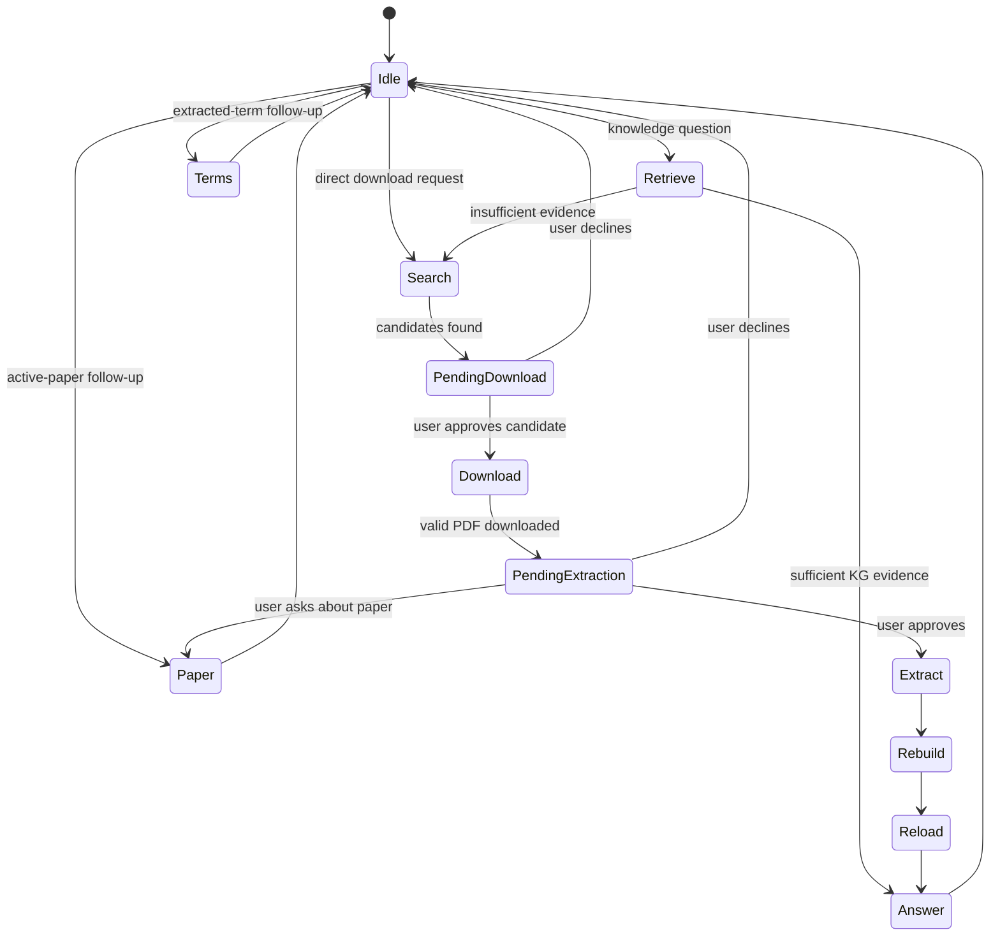

# Agent workflow

The current workflow is implemented primarily by
`AgentPipelineService` in `app/modules/f2w_agent/api.py`. The command-line
`Coordinator.run()` delegates to the same service, keeping UI and CLI behavior
aligned.

## Participants

| Component | Role |
|---|---|
| `WorkflowOrchestratorAgent` | Routes each turn and validates the proposed action |
| `RetrievalAgent` | Searches the active KG, constructs context, and judges sufficiency |
| `DownloadAgent` | Searches OpenAlex/arXiv, ranks metadata, downloads, and validates PDFs |
| `ExtractorAgent` | Runs full or targeted terminology extraction |
| `EvidenceDebateAgent` | Chooses the cheapest evidence-safe action with heuristic fallback |
| `PaperEvidenceAgent` | Answers against a downloaded paper with page-bounded citations |
| `SessionMemory` | Preserves topics, entities, publications, decisions, and summaries |
| `WorkflowStateStore` | Persists phase, pending approval, candidates, active paper, and last action |

## Turn routing

The orchestrator has deterministic safety checks around its LLM decision:

- a pending approval takes precedence over unrelated proposed actions;
- invalid action names fall back to safe routing;
- a fresh request to download a named paper can enter candidate search without
  first forcing an insufficient KG answer;
- active-paper and extracted-term requests can be served without starting a
  new literature search;
- action loops and unavailable candidates fail closed.

## Evidence-first path

1. The service activates the requested session and enriches contextual
   follow-ups from session memory.
2. `RetrievalAgent.query()` searches nodes and refuses to call the LLM when no
   selected node has direct evidence.
3. It builds bounded structured context and asks a strict judge for:
   `sufficient`, `answer`, and `missing_topics`.
4. Sufficient evidence becomes the response.
5. Insufficient evidence triggers metadata-only literature search.
6. Candidate download and extraction are separate approval boundaries.
7. Extracted terms rebuild the session JSON graph, optionally reimport Splash
   Links, and reload retrieval.
8. The final result records graph growth, provenance, and the used node IDs.

## Direct publication download

The direct-download router recognizes arXiv IDs, DOI-like references, URLs, and
natural-language requests such as “download the paper about …”. It sanitizes
queries for OpenAlex and can supplement OpenAlex results with arXiv candidates.

Metadata search itself is non-destructive. The API returns candidate cards and
stores a pending `download` action. The selected PDF is downloaded only after
approval.

Downloads:

- prefer open-access PDF URLs;
- exclude publisher landing pages from PDF candidates;
- retry candidate URLs with a configurable delay;
- stream through a `.part` file;
- require `%PDF-` magic bytes;
- optionally ask an LLM to reject semantically irrelevant papers; and
- preserve alternative candidates after a failed attempt.

## Extraction approval

After a successful download, the state becomes pending `extraction`.

- **Targeted extraction** scores pages against the question and missing topics,
  processes at most `targeted_max_pages`, and records selected pages in the
  extraction manifest.
- **Full extraction** processes all pages and marks the PDF as fully handled.
- Declining extraction clears the pending step without preventing a later
  direct paper-download request.

## Paper evidence

`PaperEvidenceAgent` reads only eligible pages:

- targeted mode uses pages recorded in the manifest;
- full mode ranks pages and caps the prompt at eight pages;
- claims must cite the source filename and valid page numbers;
- invalid citations receive one repair attempt and otherwise fail closed.

This route answers about an active downloaded paper without prematurely adding
unextracted claims to the KG.

## Session files

A work directory may contain:

| File/path | Purpose |
|---|---|
| `pdfs/` | Downloaded papers |
| `extract_rounds/` | Staged unprocessed PDFs for each round |
| `terms.json` | Cumulative extracted terms |
| `kg.json` | Session graph snapshot |
| `processed_pdfs.json` | Fully processed PDF names |
| `extraction_manifest.json` | Full/partial extraction state and selected pages |
| `session_memory.json` or session equivalent | Topic-aware conversation memory |
| `workflow_state.json` or session equivalent | Persisted phase and pending action |

Named browser sessions isolate these artifacts. Deleting a chat calls the
backend session deletion endpoint in addition to removing local UI history.

## Progress streaming

`POST /chat/stream` and `/chat/action/stream` return Server-Sent Events:

- `progress` reports phases such as retrieval, candidate search, download,
  extraction, KG rebuild, and orchestration;
- `complete` contains the normal `ChatResponse`;
- `error` contains a safe failure payload.

The frontend falls back to the non-streaming endpoint only if no stream event
was received.
