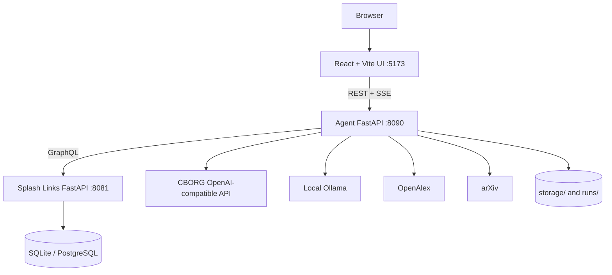
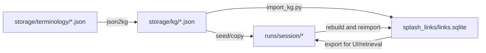

# System architecture

## Runtime topology

The UI never accesses Splash Links directly. All graph reads and edits pass
through the agent API, which normalizes Splash records into the MatKG/UI shape.

## Python package boundaries

| Package | Responsibility |
|---|---|
| `app.modules.f2w_agent` | Chat API, workflow routing, agents, session state, KG rebuild/reimport |
| `app.modules.term_extractor` | PDF processing, schema validation, term merging, code/provenance extraction |
| `app.modules.kg_rag_api` | KG loading, search, graph expansion, context construction, LLM clients, OpenWebUI proxy |
| `app.modules.json2kg` | Extracted-terms JSON to MatKG graph conversion |
| `app.modules.agents` | ChEBI, Materials Project chemistry checks, and physical-property helpers |
| `splash_links.src.splash_links` | SQL-backed entity/link/embedding service and client |
| `app.modules.legacy` | Historical pipelines retained for reference or compatibility |

## Two HTTP APIs

There are two separate FastAPI surfaces:

1. **Agent API** (`f2w_agent api`, normally port `8090`) is used by the current
   React application. It owns workflow state, graph editing, settings,
   publication search, and SSE progress.
2. **KG-RAG compatibility API** (`kg_rag_api.py --api`, normally port `11435`)
   mimics Ollama/OpenAI endpoints for OpenWebUI clients. It does not provide the
   current UI workflow contract.

Do not point the React application at port `11435`.

## Storage boundaries

- `storage/` contains long-lived schemas, extracted term datasets, graph
  snapshots, competency questions, and missing-node logs.
- `runs/` contains mutable per-session PDFs, terms, graph snapshots, extraction
  manifests, memory, and workflow state.
- `splash_links/links.sqlite` is the default local durable graph database.
- `.run/` only contains launcher PID files.

## Configuration precedence

Most shared configuration follows:

1. explicit function or CLI argument;
2. environment variable, including values loaded from `.env`;
3. `config.yml`;
4. a hard-coded fallback.

`app/modules/project_config.py` implements dotted lookup, environment aliases,
type casting, boolean coercion, and secret-only environment lookup.

## Concurrency and safety

- Page extraction uses a `ThreadPoolExecutor`.
- CBORG requests are capped by `cborg_limiter.py` across synchronous and
  asynchronous callers.
- Agent API mutations are serialized by the service's async lock.
- Session memory and workflow state use per-session files and atomic replace.
- Downloads write `.part` files, validate the PDF magic bytes, then promote
  completed files.
- KG build scripts use temporary outputs and retain `.bak` copies.
- Destructive Splash database reset requires a typed confirmation and refuses
  external paths or a running managed service.
