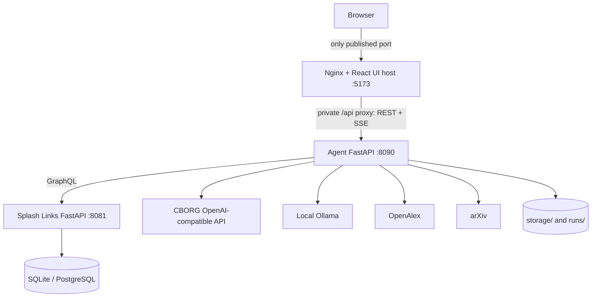
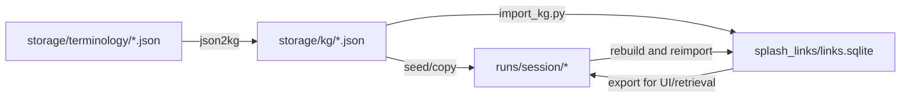

# System architecture

## Runtime topology

```mermaid
flowchart TB
    Browser[Browser]
    UI[Nginx + React UI host :5173]
    API[Agent FastAPI :8090]
    Splash[Splash Links FastAPI :8081]
    DB[(SQLite / PostgreSQL)]
    CBORG[CBORG OpenAI-compatible API]
    Ollama[Local Ollama]
    OpenAlex[OpenAlex]
    Arxiv[arXiv]
    Files[(storage/ and runs/)]

    Browser -->|only published port| UI
    UI -->|private /api proxy: REST + SSE| API
    API -->|GraphQL| Splash
    Splash --> DB
    API --> CBORG
    API --> Ollama
    API --> OpenAlex
    API --> Arxiv
    API --> Files
```

The UI never accesses Splash Links directly. All graph reads and edits pass
through the agent API, which normalizes Splash records into the MatKG/UI shape.
In Compose, the agent and Splash ports are not published to the host. Nginx is
the only ingress and strips `/api` before forwarding requests to the agent.

## Python package boundaries

| Package | Responsibility |
|---|---|
| `app.modules.launchers` | Executable CLI/API, Academy dashboard, remote extraction, and auth entry points |
| `app.modules.f2w_agent` | Chat API, workflow routing, agents, session state, KG rebuild/reimport |
| `app.modules.term_extractor` | PDF processing, schema validation, term merging, code/provenance extraction |
| `app.modules.kg_rag_api` | KG loading, search, graph expansion, context construction, LLM clients, OpenWebUI proxy |
| `app.modules.json2kg` | Extracted-terms JSON to MatKG graph conversion |
| `app.modules.agents` | ChEBI, Materials Project chemistry checks, and physical-property helpers |
| `splash_links.src.splash_links` | SQL-backed entity/link/embedding service and client |
| `app.modules.legacy` | Historical pipelines retained for reference or compatibility |

## Two HTTP APIs

There are two separate FastAPI surfaces:

1. **Agent API** (`python3 -m app.modules.launchers.f2w_agent api`, normally
   port `8090`) is used by the current
   React application. It owns workflow state, graph editing, settings,
   publication search, and SSE progress.
2. **KG-RAG compatibility API** (`kg_rag_api.py --api`, normally port `11435`)
   mimics Ollama/OpenAI endpoints for OpenWebUI clients. It does not provide the
   current UI workflow contract.

Do not point the React application at port `11435`.

## Storage boundaries

```mermaid
flowchart LR
    Terms[storage/terminology/*.json]
    Graphs[storage/kg/*.json]
    Session[runs/session/*]
    Sqlite[splash_links/links.sqlite]

    Terms -->|json2kg| Graphs
    Graphs -->|seed/copy| Session
    Graphs -->|import_kg.py| Sqlite
    Session -->|rebuild and reimport| Sqlite
    Sqlite -->|export for UI/retrieval| Session
```

- `storage/` contains long-lived schemas, extracted term datasets, graph
  snapshots, competency questions, and missing-node logs.
- `runs/` contains mutable per-session PDFs, terms, graph snapshots, extraction
  manifests, memory, and workflow state.
- `splash_links/links.sqlite` is the default local durable graph database;
  Compose stores it in the `splash-data` named volume.
- `.run/` only contains launcher PID files.

## Configuration precedence

Most shared configuration follows:

1. explicit function or CLI argument;
2. environment variable, including values loaded from `.env`;
3. `config.yml`;
4. a hard-coded fallback.

`app/modules/project_config.py` implements dotted lookup, environment aliases,
type casting, boolean coercion, and secret-only environment lookup.

## Concurrency and safety

- Page extraction uses a `ThreadPoolExecutor`.
- CBORG requests are capped by `cborg_limiter.py` across synchronous and
  asynchronous callers.
- Agent API mutations are serialized by the service's async lock.
- Session memory and workflow state use per-session files and atomic replace.
- Downloads write `.part` files, validate the PDF magic bytes, then promote
  completed files.
- KG build scripts use temporary outputs and retain `.bak` copies.
- Destructive Splash database reset requires a typed confirmation and refuses
  external paths or a running managed service.

## Multi-KG layout

Chat retrieval does **not** concatenate JSON dumps. Each file is a separate
graph. The agent fans out retrieve per path and merges scored hit lists tagged
with `graph_id` (`app/modules/f2w_agent/multi_kg.py`).

| Corpus | Typical files | `graph_id` | Namespace | Schema |
|---|---|---|---|---|
| RSoXS literature | `storage/kg/matkg_rsoxs_vN.json` | `rsoxs_vN` | `matkg:` | `storage/schema/rsoxs_schema.yaml` |
| ALS 11.0.1.2 ops | `storage/kg/matkg_bl1101_vN.json` | `bl1101` | `beamline:` | `storage/schema/bl1101_schema.yaml` |
| X-ray fundamentals (planned) | `storage/kg/matkg_xray_vN.json` | `xray_vN` (when wired) | `xray:` | `storage/schema/xray_schema.yaml` |
| X-ray demo (opt-in) | `storage/kg/matkg_xray_papers_cborg_chat.json` | `xray_demo` | mixed | not auto-selected |
| Experiment identity | live Tiled GraphQL | `tiled` | Tiled URIs | not a JSON KG |

Settings JSON mode is a **checkbox catalog**. Defaults are the latest RSoXS
snapshot plus the latest bl1101 snapshot. The x-ray demo file is never
auto-unioned. More checked graphs slow queries (fan-out × N).

Intent routing still queries every selected graph; it only changes how
candidate slots and context budget are allocated (literature vs ops vs Tiled).
Hardware layout / beam-path questions prefer ops nodes and directed edges
(`beam_path_next`, `upstream_of`, `feeds`, `connected_to`), never cuprate
literature elaboration.

LinkML files, extract overlays, and PROV-O reference docs are listed in
[LinkML schemas](schemas.md) and `storage/schema/README.md`.

## Tiled Graph as experiment identity

From `matkg_bl1101_v8.json` onward, ESAF / Proposal / Sample / BlueskyRun
nodes are **intentionally absent** from the ops JSON KG. Live Tiled Graph
(`TILED_URI`, default `http://127.0.0.1:8765`, GraphQL
`POST {TILED_URI}/api/graphql`) is the **sole source** of experiment-identity
data.

Unsigned or empty catalogs return empty identity lists (not invented ESAFs).
Never log `TILED_API_KEY`. Chat settings must not follow ALS production Tiled
hosts (`als.lbl.gov`); `coerce_local_tiled_uri` keeps lookup on a local
catalog. Catalog `tiled.client` is only a supplement when GraphQL has no
BlueskyRun entities yet.

Simulated ESAFs for local demos are ingested with
`scripts/ingest_tiled_sim.py` into Tiled, not baked back into the JSON KG.

## KG promotion pipeline

1. Harvest OA PDFs into a **corpus-specific** tree (`papers/rsoxs/`, later
   `papers/xray/`). Do not mix those directories.
2. Extract terms → `storage/terminology/extracted_terms_<corpus>.json`
   (`scripts/run.py`). The harvest manifest `extracted_at` field is not yet
   written back by extract.
3. `json2kg` → versioned `storage/kg/matkg_<corpus>_vN.json`. Keep `v1`; bump
   `N` for promotions. Ops ingest (`scripts/ingest_bl1101.py`) follows the
   same `vN` pattern.
4. `start_agent_backend.sh` in JSON mode selects the highest `matkg_rsoxs_vN`
   and `matkg_bl1101_vN` unless `F2W_GRAPHS` / `F2W_GRAPH` overrides.
5. Optional Splash import is a **copy** of a snapshot, not the identity of
   the science/ops graphs. Tiled identity stays on the Tiled service.

Do not merge x-ray fundamentals into `matkg_rsoxs_v*` or `matkg_bl1101_v*`.
