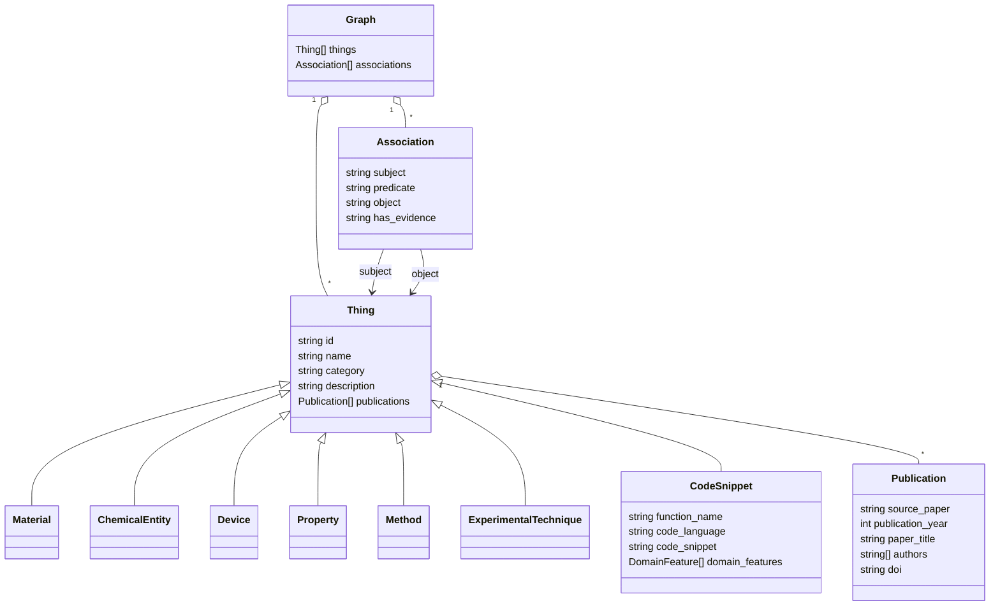

# Core data model

The LinkML schema is defined in `storage/schema/matkg_schema.yaml`. Extraction
records are richer working objects; `json2kg.py` transforms them into graph
nodes and associations; Splash Links then stores those records as generic SQL
entities and links.

## MatKG class model



The actual schema includes additional general classes (`Component`,
`Condition`, `Interface`, `Measurement`, `Parameter`, `Phenomenon`, `Process`,
and `Structure`) and specialized material/device/property types.

## Extraction model

`TermRecord` is the cumulative pre-graph model:

```text
TermRecord
├── term, definition, category, raw_category
├── formula and formula_validation
├── RelationRecord[]
├── PropertyRecord[]
├── pages[] and source_papers[]
├── ContextSnippet[]
├── source_metadata{source_paper -> publication fields}
└── publications[]
```

Top-level extraction JSON additionally carries `metadata` and
`code_snippets`.

## MatKG to Splash mapping

| MatKG | Splash Links |
|---|---|
| `thing.id` | entity `uri`, plus `properties.matkg_id` |
| `thing.name` | entity `name` |
| `thing.category` | entity `entity_type` |
| Other node fields | entity `properties` |
| Association subject/object IDs | link subject/object UUIDs |
| Association predicate | link `predicate` |
| Evidence/source file | link `properties` |

This mapping lets Splash use internal UUIDs while the application preserves
stable MatKG identifiers.

## UI normalization

The agent API maps graph records to:

```text
GraphPayload
├── nodes: {id, label, type, description, publications, code, linked snippets}
├── edges: {source, target, predicate}
└── source_path
```

Publication fields are normalized and deduplicated before reaching the UI.
Code snippets may be first-class nodes and also appear as linked detail records.
