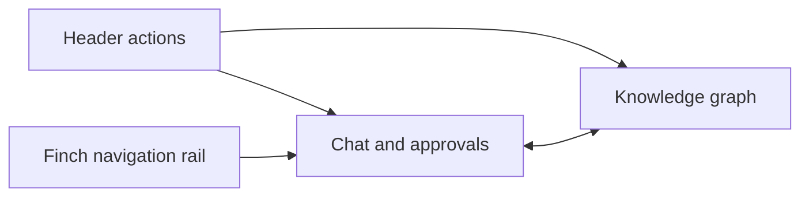

# Web UI overview

FAIR2WISE's browser application is a React 18 and Vite 6 project in `ui/`.
It is the preferred interactive surface for asking materials-science
questions, following agent progress, approving evidence acquisition, exploring
the knowledge graph, and managing publications.

## UI documentation

| Page | Audience and scope |
|---|---|
| [User guide](ui-user-guide.md) | Chat, sessions, approvals, paper search, bookmarks, and settings |
| [Knowledge graph UI](ui-knowledge-graph.md) | Viewer modes, navigation, citations, node search, and graph editing |
| [UI architecture](ui-architecture.md) | Component ownership, state flow, persistence, and source inventory |
| [Agent API integration](ui-api.md) | HTTP/SSE contract used by the browser, cancellation, and error behavior |
| [UI development and testing](ui-development.md) | Local setup, builds, Docker, styling, tests, and debugging |

## Start the application

Docker Compose is the recommended application deployment:

```bash
docker compose up --build
```

Open `http://127.0.0.1:5173`. In Compose, Nginx serves the built UI and
reverse-proxies `/api` to the private agent container. The browser cannot
connect directly to Splash, and the agent and database ports are not published
to the host.

For local development without Docker:

```bash
cd ui
npm ci
cd ..
./scripts/start_all.sh
```

The local Vite application also opens at `http://127.0.0.1:5173`; it talks to
the agent at `http://127.0.0.1:8090` by default.

## Screen layout

The application has a single `/` route inside the Finch shell:



The header contains actions for new chats, chat search, paper search,
bookmarks, and settings. The main area normally uses vertically resizable chat
and graph panels. KG Viewer mode replaces that split with a full-width graph.

## Principal capabilities

- Stream agent progress and graph updates while a question runs.
- Stop an active request through `AbortController` cancellation.
- Resume download/extraction workflows through explicit user decisions.
- Retain multiple browser chat sessions and matching backend session IDs.
- Highlight `[KG: ...]`, code, PDF, DOI, and publication evidence on the graph.
- Search KG nodes using the active lexical or semantic retrieval backend.
- Inspect nodes, edges, publication provenance, and linked code snippets.
- Edit Splash-backed node properties and directed relationships.
- Search KG publications, optionally merging OpenAlex results.
- Bookmark publications locally and open DOI, arXiv, or Semantic Scholar links.
- Change workflow, extraction, LLM, model, and graph-source settings.

## Runtime boundaries

The browser never receives `CBORG_API_KEY` or other service credentials. Those
remain in the agent process. The UI stores only preferences, chat display
history, and publication bookmarks in browser local storage.

Splash is the editable graph source. JSON graph mode is retrieval-only: node
editing, literature download, and extraction are unavailable in that mode.

## Source entry points

| File | Role |
|---|---|
| `ui/src/main.tsx` | Mount React and load the style entry point |
| `ui/src/app/App.tsx` | Finch shell, route, sessions, boot synchronization, and graph state |
| `ui/src/app/components/ChatSidebar.tsx` | Live conversation and approval workflow |
| `ui/src/app/components/GraphMockup.tsx` | Active graph renderer, search, detail, and editor |
| `ui/src/app/components/data/liveAgent.ts` | Typed HTTP/SSE client |
| `ui/src/app/components/agentSettings.ts` | Settings normalization and local persistence |
| `ui/src/app/components/chatSessions.ts` | Chat session persistence and migration |

See [UI architecture](ui-architecture.md) for the complete source inventory.
