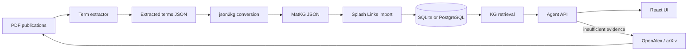

# FAIR2WISE

FAIR2WISE turns materials-science publications into a provenance-aware
knowledge graph and uses that graph to answer questions, identify missing
evidence, retrieve papers, and expand the graph.

This site documents the maintained codebase: the React application, agent API,
orchestrated evidence workflow, extraction pipeline, KG conversion and
retrieval, Splash Links graph service, operational scripts, tests, and legacy
compatibility modules.

## What runs

| Service | Default address | Implementation | Purpose |
|---|---:|---|---|
| Web application | `http://127.0.0.1:5173` | `ui/` | Chat, graph exploration/editing, publication search, settings |
| Agent API | local `:8090`; Compose-private | `app/modules/f2w_agent/api.py` | Sessions, orchestration, KG reads/edits, streaming chat |
| Splash Links | local `:8081`; Compose-private | `splash_links/` | Persistent entities, directed links, and embeddings |

`./scripts/start_all.sh` starts all three services and shuts them down together.
For the recommended container deployment, `docker compose up` starts the stack
and publishes only the web application.

## End-to-end data flow

## Main concepts

- **Term extraction** processes PDF pages through an LLM, validates terms
  against the LinkML schema, merges duplicate records, and attaches
  publication and source-code provenance.
- **MatKG JSON** is the portable graph format: `things` are nodes and
  `associations` are directed edges.
- **Splash Links** stores editable graph records. It exposes GraphQL plus REST
  endpoints for vector embeddings.
- **KG-RAG retrieval** supports lexical or SentenceTransformer/FAISS search,
  graph expansion, evidence-aware ranking, and bounded context assembly.
- **The workflow orchestrator** decides whether to answer from the KG, search
  for candidate publications, request download or extraction approval, query
  an active paper, or report extracted terms.
- **Sessions** isolate chat memory, workflow state, pending approvals, and
  session graph files.

## Documentation paths

- Start with [Getting started](getting-started.md).
- Read [System architecture](architecture.md) before changing service
  boundaries.
- Use [Repository reference](repository-reference.md) to locate ownership for a
  feature.
- Consult [Agent API](agent-api.md) and [Splash Links](splash-links.md) when
  changing client/server contracts.
- Follow [Testing](testing.md) before submitting changes.

!!! note "Source of truth"

    The documentation describes the checked-in implementation. Configuration
    values can be overridden by CLI arguments and environment variables; see
    [Configuration](configuration.md).
