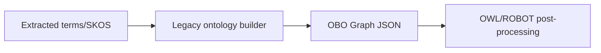

# Legacy code

Historical implementations remain under `app/modules/legacy/` for
reproducibility and reference. They are not imported by the current
`start_all.sh` stack.

| File | Historical purpose |
|---|---|
| `build_onto.py` | Convert SKOS/material graphs to ontology/OWL forms, optionally using ROBOT |
| `extract_terms.py` | Early Ollama-only term extractor |
| `extract_terms_linkml.py` | Earlier LinkML-aware extractor |
| `extract_terms_linkml_jun3.py` | Dated extraction snapshot |
| `extracted_terms_json2kg_with_context.py` | Earlier terms-to-KG converter preserving context |
| `json2kg.py` | Earlier graph converter and embedded tests |
| `kg_rag_ollama.py` | Early local Ollama KG-RAG implementation |
| `kg_rag_ollama_nersc.py` | NERSC-specific interactive KG-RAG implementation |

## Current replacements

| Legacy concern | Current implementation |
|---|---|
| Term extraction | `app/modules/term_extractor/` or `app/modules/extract_terms.py` |
| Graph conversion | `app/modules/json2kg.py` |
| RAG and model clients | `app/modules/kg_rag_api.py` |
| NERSC agent workflow | `f2w_agent.py` plus `scripts/run_nersc_3agent.sh` |
| Graph persistence | Vendored `splash_links/` |

## Change policy

- Do not add new application features only to legacy modules.
- Preserve legacy files when old experiment reproduction depends on them.
- If fixing a security or data-loss issue in a callable legacy path, document
  the reason and add a focused test.
- Do not assume output from a legacy converter has every publication,
  code-snippet, or source-scoped provenance field expected by the current UI.
- The copied `scripts/app/modules/kg_rag_api.py` is also non-canonical. Update
  `app/modules/kg_rag_api.py` first and either synchronize or retire the copy
  explicitly.

## Ontology path

`build_onto.py` is separate from the active property graph:

The active chat application does not require this ontology conversion. It uses
MatKG JSON and Splash Links directly.
