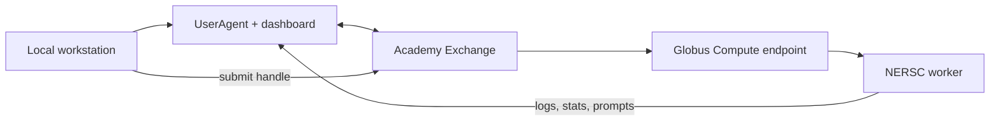

# NERSC and remote extraction

FAIR2WISE supports two related remote paths:

1. run the orchestrated agent/API through SSH on NERSC; and
2. launch a monitored extraction agent through Academy and Globus Compute.

## Components



## Prepare NERSC

Required local variables:

```bash
export NERSC_USER=your-user
export NERSC_REPO=/pscratch/sd/x/your-user/f2wlocal
```

Sync and set up:

```bash
scripts/deploy_nersc.sh --sync-code --setup
```

The deploy script excludes `.env`, virtual environments, caches, runs, and
agent tooling directories. It can independently sync PDFs, restart the named
Globus endpoint, and submit extraction.

## Remote secrets

`scripts/write_nersc_env.sh` reads selected values from local `.env`, sends them
over SSH without printing them, writes `~/.f2w_nersc_env`, and sets mode 600.

Review its defaults before use:

```bash
NERSC_USER=your-user \
NERSC_HOST=perlmutter.nersc.gov \
scripts/write_nersc_env.sh
```

The remote agent scripts source this file when it exists.

## Academy dashboard

First authenticate through the normal Academy flow so the token cache exists,
then start the user agent:

```bash
python3 -m app.modules.launchers.academy_auth
python3 -m app.modules.launchers.user_agent --port 8000
```

The launcher:

- reads a non-expired Academy Exchange token from the shared cache;
- starts `UserAgent` in a local thread pool;
- serves its Flask dashboard;
- writes `user_agent_handle.pkl`; and
- waits for the agent.

`UserAgent` receives registration, log, statistics, and prompt messages.
The dashboard uses SSE for live updates and exposes response/dismiss/shutdown
routes.

## Submit extraction

```bash
python3 -m app.modules.launchers.academy_extractor \
  --data-dir /remote/path/pdfs \
  --output /remote/path/terms.json \
  --backend cborg \
  --model lbl/cborg-chat \
  --schema-path /remote/repo/storage/schema/matkg_schema.yaml \
  --max-workers 4
```

The local client creates a Globus executor, launches `TermExtractorAgent`,
invokes `process_directory`, reads the final term count, and shuts the agent
down.

## Remote three-agent commands

```bash
scripts/run_nersc_3agent.sh status
scripts/run_nersc_3agent.sh ask "What is find_scattering_peaks used for?"
scripts/run_nersc_3agent.sh chat
```

The script builds a shell-quoted remote command from `F2W_*` settings. In
Splash mode it passes the explicit wipe capability, so confirm the configured
remote Splash repository/database before use.

`f2w_nersc_smoke.sh` performs a one-question smoke run.
`f2w_nersc_api.sh` starts the remote API and accepts explicit CORS origins.

## Slurm Ollama

`slurm_scripts/run_ollama.sh` is the batch launcher for a remote Ollama
service. Its model cache, port, resources, and module environment should be
adapted to the target allocation.

## Operational cautions

- NERSC scripts contain example `/pscratch` defaults; override them for each
  account.
- The remote setup script currently accepts Python 3.10+, while the main local
  and Docker documentation targets Python 3.12.
- Keep secrets in the protected remote environment file, never in rsynced
  source.
- `user_agent_handle.pkl` is runtime identity state and must not be shared.
- Ensure the endpoint worker can import this repository and access the same
  paths passed by the submission client.
