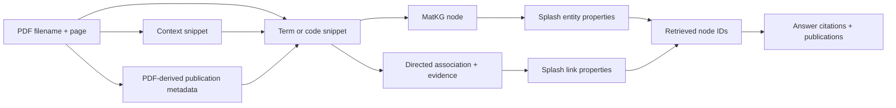

# Data provenance

FAIR2WISE preserves a chain from source PDF pages to extracted records, graph
nodes/edges, retrieved evidence, and response publications. The chain supports
inspection; it is not a cryptographic proof and does not make LLM extraction
infallible.

## Provenance chain



| Layer | Linking fields |
|---|---|
| PDF | Source filename and one-based PDF page number |
| Extracted term | `source_papers`, `pages`, `context_snippets`, `source_metadata` |
| Code snippet | Source paper/page plus code body; repository-derived snippets also retain repository, commit, file, line, and license fields |
| Publication | `source_metadata[source_paper]` and derived `publications[]` entries |
| MatKG node | Stable-ish `matkg:` ID plus all term/snippet provenance fields |
| MatKG edge | Subject, predicate, object, and optional `has_evidence` text |
| Splash | MatKG ID in entity URI and `properties.matkg_id`; source KG filename in `properties.source_file` |
| Retrieval/answer | Selected node IDs, structured node/edge context, inline KG/PDF citations, and publication `supporting_nodes` |
| Session memory | Turn-level node IDs and compact publication references |

## PDFs, terms, and publications

The extractor processes pages as one-based citations even though PDF libraries
use zero-based indexes internally. Each term records the source filename, page,
and a bounded text context. When the same term appears again, its page and
source lists grow instead of creating another term record.

Publication metadata is extracted separately from PDF document metadata and
first-page text. It is not accepted from the term-extraction LLM. Metadata is
stored under the source filename:

```json
{
  "term": "Example material",
  "source_papers": ["paper-a.pdf", "paper-b.pdf"],
  "source_metadata": {
    "paper-a.pdf": {"doi": "10.example/a", "paper_title": "..."},
    "paper-b.pdf": {"doi": "10.example/b", "paper_title": "..."}
  }
}
```

This source-scoped map prevents one paper's authors, DOI, or year from being
applied to another paper merely because both mention the same term. Before
persistence, the extractor derives `publications[]` from the map. During graph
conversion, explicit `publications[]` takes priority, then `source_metadata`;
legacy scalar publication fields are used only when a record has at most one
source.

## Relationships and code snippets

Extracted relations retain the related term and any supplied evidence. Graph
conversion turns them into directed `(subject, predicate, object)`
associations and joins evidence strings into `has_evidence`.

Code snippets are separate `CodeSnippet` nodes. PDF-derived snippets keep the
paper, page, function name, language, code, description, domain features, and
source-scoped publication metadata. When a PDF explicitly links a GitHub
repository, the optional repository pass can also preserve:

- repository URL, owner, name, default branch, and commit SHA;
- source file URL/path and start/end lines;
- reported repository license or a missing-license warning; and
- the score used to select the source file.

`rel:has_code_snippet` connects scientific term nodes to snippet nodes,
preferring a same-paper/same-page match and falling back to a same-paper match.
That relationship means the records share source context; it does not by itself
prove the code implements the scientific claim.

## Identifier and deduplication rules

Different stages use intentionally different keys:

| Record | Canonical/deduplication rule |
|---|---|
| Extracted term | `term.strip().lower()` |
| Term context | `(source_paper, page)` within a merged term |
| Term relation | Exact `(relation, related_term)` within a merged term |
| Code snippet record | `(source_paper, page, stripped code body)` |
| MatKG term node | `matkg:` plus the display term with spaces/punctuation removed; letters retain case and hyphens remain |
| MatKG code node | Function/source/page seed plus the first 8 hex characters of an MD5 code-body digest |
| MatKG edge | Exact `(subject ID, predicate, object ID)` |
| Publication in API responses | Normalized DOI when present; otherwise lowercased `(source_paper, paper_title)` |
| Splash entity | Generated Splash UUID; MatKG identity retained separately in URI/properties |

Term merging appends unique pages and papers, keeps the longer definition,
adds new relations, and fills missing chemistry fields without replacing
existing non-empty values. Source metadata merges only within the matching
source filename.

The rules are deterministic but not globally collision-proof. For example,
`A/B` and `AB` produce the same MatKG ID, while spelling variants such as
`poly(3-hexylthiophene)` and `P3HT` remain separate unless extraction
normalizes them. When two raw nodes collide during conversion, the first node
payload wins while later relations may still attach to that ID. Review aliases
and IDs before importing heterogeneous corpora.

The Splash importer creates records; it does not perform a general upsert by
MatKG ID. `--if-empty` is the safe bootstrap guard. Intentional corpus merges
must deduplicate MatKG nodes and edge triples before import.

## Retrieval and citations

Retrieval refuses to treat a node as direct evidence unless it has source
papers, publications, context snippets, code, or an evidence-bearing adjacent
edge. The answer judge is instructed to use only retrieved context, avoid
inventing bibliographic/numeric facts, and cite literal KG or PDF evidence.

Publication cards are collected from selected nodes. Duplicate cards merge by
DOI or source/title, page lists are combined, and `supporting_nodes` records
which selected nodes led to the publication. This is useful traceability, but a
publication card is not proof that every sentence in the answer appears in
that publication; inspect the inline citation and node context.

Downloaded-paper answers use only pages eligible in the extraction manifest.
Targeted mode uses selected pages; full mode ranks pages and caps the prompt.
The paper agent validates cited page numbers and makes one repair attempt before
failing closed.

## Reliability and limitations

Treat FAIR2WISE citations as audit pointers, not final scholarly verification:

- PDF text extraction can lose columns, symbols, equations, tables, images,
  headers, and reading order.
- Stored page numbers are PDF-file pages and may differ from the journal's
  printed pagination.
- Context snippets are bounded excerpts; term-context deduplication keeps one
  snippet per source/page, so another passage on the same page can be omitted.
- Publication metadata uses PDF fields and first-page heuristics. Preprints,
  supplements, malformed metadata, and scanned documents can be misidentified.
- DOI/author/title presence does not imply that the extracted claim was
  independently verified against the publisher record.
- LLMs can misclassify terms, relations, properties, and code despite schema
  validation and strict answer prompts.
- Same-paper code links are contextual associations, not execution or semantic
  verification.
- Manual graph edits can change or remove extracted provenance. A later
  rebuild/reimport can also replace edits if the edited data is absent from the
  cumulative terms artifact.
- External OpenAlex results are discovery metadata until a PDF is approved,
  extracted, and linked into the graph.

For high-stakes use, open the cited PDF at the stored page, compare the quoted
context with the original layout, verify bibliographic data against a primary
record, and retain the terms JSON alongside the graph and database backup.

See [Terminology extraction](term-extraction.md) for field production,
[Knowledge graph](knowledge-graph.md) for conversion, and
[Security model](security.md) for protecting source artifacts.
