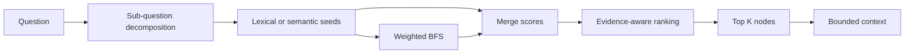

# Retrieval and RAG

`app/modules/kg_rag_api.py` supplies the shared `KnowledgeGraph` used by the
agent workflow and the compatibility chat API.

## Graph loading

`KnowledgeGraph` loads either:

- `things` and `associations` from a JSON file; or
- paginated entities/links from Splash Links through GraphQL.

It builds:

- `nodes`, keyed by MatKG ID;
- outgoing adjacency lists;
- canonical-name lookup;
- a searchable text string per node; and
- either token sets or a FAISS vector index.

Search text includes name, description, source papers, publication identifiers,
code metadata, and domain features.

## Search backends

### Lexical

Lexical search tokenizes the query and node text, scores token overlap, adds a
name-match boost, caps scores at one, and caches results per query.

### Semantic

Semantic search:

1. loads the configured SentenceTransformer;
2. selects CUDA, Metal, or CPU as available;
3. embeds node text in batches with normalized vectors;
4. builds FAISS IVF-Flat, falling back to flat inner product when needed;
5. embeds the query;
6. converts inner-product similarity to a zero-to-one score; and
7. removes canonical-name duplicates.

GPU encoding and index construction each have CPU fallback paths.

!!! important

    `semantic_search()` is the public dispatcher despite its name. It uses the
    active lexical backend when `KG_RAG_RETRIEVAL_BACKEND=lexical`.

## Graph expansion and ranking

Weighted BFS traverses outgoing edges to the configured hop limit. Edge
weights favor typed relations over generic `RELATED_TO`; generic node names are
penalized. `build_nodeinfo()` combines:

- semantic score;
- graph-expansion score and depth;
- lexical overlap;
- evidence count from publications, source papers, and edges; and
- publication recency.

Stepwise retrieval can decompose compound questions and merge seeds from
multiple sub-questions before the final cap. Code snippet results have a
separate cap so they cannot dominate the context.

## Context construction

The context builder renders only facts attached to selected/rendered nodes and
respects the soft character budget. Depending on available data it includes:

- node ID, name, type, description, formula, and properties;
- source-scoped publication metadata;
- page context snippets or PDF snippets;
- directed relationships between rendered nodes;
- evidence strings;
- code body, language, function, domain, and domain features; and
- linked code snippets.

Scalar paper metadata is not spread across a node with multiple sources.
Source-scoped `publications` or `source_metadata` takes precedence.

## Evidence gate

`RetrievalAgent` first checks whether any selected node contains direct
evidence: source papers, publications, context, code, or evidenced edges.
With no direct evidence it returns `sufficient: false` without spending an LLM
call.

With evidence, a strict judge decides whether context answers the question and
returns missing topics when it does not. The final generation prompt requires
KG-grounded claims and provenance-aware citations.

## Missing-node tracking

The compatibility API writes unresolved queries to
`storage/knowledge_gaps/missing_nodes_*.jsonl`. Each record supports later
analysis of terms or evidence absent from a graph.

## OpenWebUI-compatible API

`create_fastapi_app()` exposes:

| Endpoint | Compatibility |
|---|---|
| `POST /api/chat` | Ollama chat |
| `POST /v1/chat/completions` | OpenAI chat completions |
| `GET /api/tags` | Ollama model discovery |
| `GET /api/version` | Ollama-style version |
| `GET /v1/models` | OpenAI model discovery |
| `GET /api/ps` | Ollama process listing |

This API is separate from the React-facing agent API documented in
[Agent API](agent-api.md).
