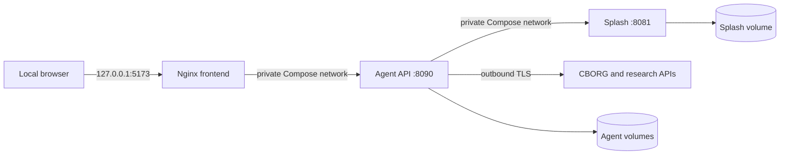

# Security model

FAIR2WISE is currently a trusted, single-operator workstation application.
Its safe default comes primarily from binding the sole published port to
loopback, not from application-level authentication. Do not expose the default
stack directly to an untrusted network.

## Trust boundaries



Compose publishes only:

```text
127.0.0.1:${F2W_UI_PORT:-5173} -> frontend:80
```

Agent and Splash ports are not host-published. This reduces direct exposure,
but Nginx proxies `/api/` to the agent. Therefore any process or user that can
reach the frontend can also call chat, settings, upload, session, and graph
mutation endpoints through the same port.

## Secrets

Keep secrets in the root `.env` or a process-level environment:

- `.env` and `.env.*` are ignored by Git;
- `.dockerignore` excludes them from image build contexts while allowing the
  placeholder `.env.example`;
- Compose injects only the variables declared in `compose.yaml`; and
- the React/Vite build receives no API secrets.

Never place a key in `VITE_*`, `config.yml`, source code, screenshots, issue
reports, or committed Compose overrides. Vite variables are compiled into
browser-readable JavaScript. Avoid commands such as `docker compose config`
without `--quiet` in shared logs because resolved environment values may be
printed.

Container environment values are visible to users with Docker daemon access,
and Docker daemon access is effectively administrative. Protect the host,
Docker socket, `.env`, backups, and CI logs accordingly. Rotate a key if it is
committed or pasted into a public log; deleting the text from Git later is not
sufficient revocation.

## Network boundaries and ports

The default loopback bind means another computer cannot open FAIR2WISE
directly. Keep it for a personal workstation. For remote use, prefer an SSH
tunnel:

```bash
ssh -L 5173:127.0.0.1:5173 user@fair2wise-host
```

If a shared deployment is required, place an authenticated TLS reverse proxy
or identity-aware gateway in front of the frontend, restrict source networks,
and keep agent/Splash private. Changing the Compose binding to `0.0.0.0` without
adding authentication exposes both the UI and its proxied control plane.

CORS is not authentication. The agent's default local-development origins are
`http://localhost:5173` and `http://127.0.0.1:5173`, while Compose uses the
same-origin Nginx proxy. Non-browser clients are not stopped by CORS.

The private Compose network has IPv6 enabled to support CBORG egress. Private
service ports and outbound internet access are separate controls: not
publishing agent `8090` does not prevent the agent from contacting external
services.

## External API access and disclosed data

Depending on the workflow, the agent can make outbound requests to:

| Service | Data sent | Credential |
|---|---|---|
| CBORG | User questions, retrieved KG context, orchestration prompts, publication metadata/abstracts, and PDF page text during extraction | `CBORG_API_KEY` |
| OpenAlex/arXiv | Search query and missing-topic text | Optional `OPENALEX_EMAIL` identity for related polite-pool requests |
| Unpaywall | DOI lookup and configured email | `OPENALEX_EMAIL` |
| Materials Project | Chemical formula lookup | `MP_API_KEY` |
| GitHub | Repository/API paths for repositories explicitly linked from PDFs; selected source files are downloaded for extraction | Optional `GITHUB_TOKEN` |

Downloaded PDFs originate from external repositories and should be treated as
untrusted input. FAIR2WISE checks PDF magic bytes and parses content, but that
is not malware scanning or a content-safety guarantee. Keep dependencies
patched and do not execute extracted code snippets. Snippets are displayed as
evidence; answer generation is instructed to attach a non-execution disclaimer
when reproducing one.

CBORG's trusted-network authorization is an additional service-side control,
not a replacement for key secrecy. The address authorized in a browser must
match the address used by the container's Python client; see
[Fresh-machine deployment](deployment.md#cborg-authorization-and-ipv6).

## Graph edits and control-plane access

There are no application users, roles, access tokens, or per-node permissions.
The agent API does not authenticate requests. In Splash mode, a reachable
client can:

- change runtime-wide settings used by other connected browsers;
- patch node labels, categories, descriptions, publications, and code;
- add/unlink code-snippet nodes and add/remove relationships;
- upload JSON graph files into the managed agent work directory;
- approve downloads and extraction using a known session ID; and
- delete/reset named session state.

JSON graph mode disables node-property editing, but it is not a security
sandbox for the rest of the API. Session IDs partition workflow state; they are
not credentials.

Backend validation rejects missing relationship endpoints, self-links,
malformed predicates, and edits while JSON mode is active. It does not decide
whether a scientifically plausible edit is correct. Back up Splash before
bulk editing or extraction. Approved extraction is allowed to refresh the
Splash graph from cumulative session artifacts, which can replace data not
present in those artifacts.

For a multi-user deployment, add authentication/authorization before exposure
and define which roles may call settings, upload, action, session deletion, and
`PATCH /graph/node/*`. Network isolation alone does not provide per-user
accountability.

## Browser persistence

The UI stores plain JSON in browser `localStorage`:

| Key | Potentially sensitive content |
|---|---|
| `fair2wise.chat.sessions.v2` | Questions, answers, citations, session IDs, and message metadata |
| `fair2wise-agent-settings-v1` | Backend/model/graph/workflow preferences |
| `fair2wise-publication-favorites-v1` | Bookmarked publication metadata |

The API key is not stored there. However, local storage is readable by scripts
running on the same origin, browser extensions with sufficient permissions,
malware, and anyone using an unlocked browser profile. It is not encrypted by
FAIR2WISE and can persist after containers stop.

Use a dedicated browser profile for sensitive work, restrict extensions, lock
the workstation, and clear site data after use on a shared computer. Clearing
browser data does not delete backend session files or the graph. Delete chats
through the UI/API for backend session cleanup, and manage Docker volumes
separately.

Agent volumes and backups can contain more data than the browser: downloaded
PDFs, extracted text/terms, graph snapshots, workflow decisions, and memory.
Apply the same retention and access policy to `runs/`, `agent-runs`,
`splash-data`, and backup directories.

## Deployment checklist

- Keep the published address at `127.0.0.1` unless an authenticated gateway is
  in place.
- Confirm only the frontend has a Compose `ports` entry.
- Keep `.env` untracked and out of logs/backups shared with others.
- Authorize the intended CBORG egress address and no broader access than
  required.
- Back up graph and run state before upgrades, extraction, or bulk edits.
- Treat external PDFs and extracted code as untrusted data.
- Clear browser and backend session state according to the data-retention need.
- Review dependencies and base images during upgrades.

See [UI user guide](ui-user-guide.md#browser-persistence) for storage behavior,
[Agent API](agent-api.md) for mutating endpoints, and
[Local and Docker operation](operations.md) for diagnostics.
