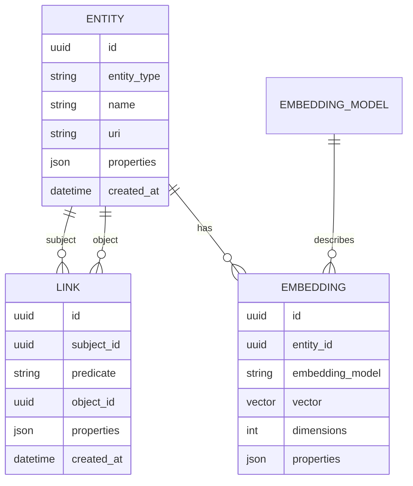

# Splash Links

`splash_links/` is a vendored, independently packageable graph service. It
stores arbitrary entities, directed predicate-labelled links, and vector
embeddings.

## Data model



Deleting an entity cascades to its attached links and embeddings.

## Server layers

| Module | Responsibility |
|---|---|
| `main.py` | Uvicorn import target; defaults to `links.sqlite` |
| `app.py` | FastAPI factory, lifespan, migrations, GraphQL mount, embedding REST |
| `schema.py` | Strawberry GraphQL types, queries, and mutations |
| `store.py` | Abstract store and SQLAlchemy SQLite/PostgreSQL implementation |
| `client/base.py` | Synchronous typed HTTP/GraphQL client |
| `client/cli.py` | Remote client CLI |
| `client/tiled.py` | Tiled-node conversion and lazy entity creation |
| `cli.py` | Local database inspection shell and tables |

## Start

```bash
cd splash_links
pixi install
pixi run serve
```

`serve` binds `0.0.0.0:8081`. `serve-dev` adds Uvicorn reload.

The normal root launcher sets `SPLASH_LINKS_DB=links.sqlite` and starts this
task before the agent API.

## GraphQL

The GraphQL endpoint and GraphiQL IDE are:

```text
http://127.0.0.1:8081/splash_links/graphql
```

Queries:

- `entity(id)` and paginated `entities(entityType)`;
- `link(id)` and filtered `links(subjectId, predicate, objectId)`;
- nested `outgoingLinks` and `incomingLinks`; and
- `nearestEmbeddings(vector, embeddingModel, entityId)`.

Mutations:

- `createEntity`, `updateEntity`, `deleteEntity`;
- `createLink`, `updateLink`, `deleteLink`.

Example:

```graphql
query {
  entities(limit: 10) {
    id
    entityType
    name
    uri
    properties
  }
}
```

## REST endpoints

| Method | Path | Purpose |
|---|---|---|
| `GET` | `/splash_links/health` | Liveness |
| `POST` | `/splash_links/embeddings` | Create an embedding |
| `GET` | `/splash_links/embeddings` | Filter/list embeddings |
| `GET` | `/splash_links/embeddings/{id}` | Get one embedding |
| `DELETE` | `/splash_links/embeddings/{id}` | Delete one embedding |

Graph records use GraphQL; embeddings have REST creation/listing plus GraphQL
nearest-neighbor search.

## Store implementation

`SQLAlchemyStore` supports SQLite paths, in-memory SQLite, and SQLAlchemy
PostgreSQL URLs. SQLite serializes vectors as binary values; PostgreSQL uses
the vector type and native cosine-distance ordering when available. Python
cosine search is the fallback.

Vectors are normalized and dimension-checked. Embedding model records retain
their expected dimensions, preventing incompatible inserts.

On startup, file/remote databases run Alembic migrations. A pre-Alembic
database with existing entity tables is stamped before upgrade.

## Client

```python
from splash_links.client.base import from_uri

client = from_uri("splash://localhost:8081")
a = client.create_entity("Material", name="P3HT", uri="matkg:P3HT")
b = client.create_entity("Property", name="Mobility", uri="matkg:Mobility")
client.create_link(a, "rel:has_property", b)
links = client.find_links(a)
```

`from_uri()` accepts `splash://`, `http://`, and `https://`. Entity arguments
can be entity models, raw IDs, or supported Tiled nodes.

The installed CLIs are:

```bash
pixi run splash-links entities
pixi run splash-links links
pixi run splash-links embeddings
pixi run splash-links shell

pixi run splash-links-client create-entity ...
pixi run splash-links-client create-link ...
pixi run splash-links-client find-links ...
pixi run splash-links-client create-embedding ...
pixi run splash-links-client nearest-embeddings ...
```

## PostgreSQL deployment

`splash_links/docker-compose.yml` starts PostgreSQL 16 and the standalone Splash
container. Set `POSTGRES_USER` and `POSTGRES_PASSWORD` before starting it.
The application receives a `postgresql+psycopg2://...` URL through
`SPLASH_LINKS_DB`.

## Reset safety

From the repository root:

```bash
./scripts/wipe_splash_db.sh
```

The utility only accepts a local SQLite database within the Splash workspace,
refuses in-memory/remote/outside paths, refuses a managed or listening Splash
service, requires the exact confirmation `WIPE splash_links`, and removes SQLite
WAL/SHM/journal sidecars with the database.
