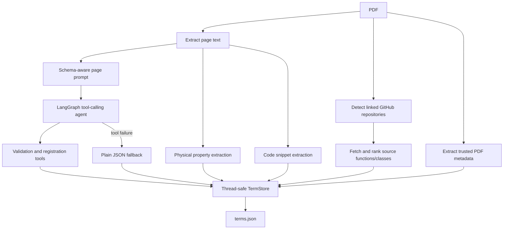

# Terminology extraction

## Active implementations

Two active entry paths share the same conceptual output:

- `app/modules/term_extractor/` is the modular implementation used by the
  current local and remote agents.
- `app/modules/extract_terms.py` is the larger standalone extractor retained as
  a supported CLI and exercised heavily by tests.

`scripts/run.py` launches the modular extractor. `scripts/build_kg.sh` calls the
standalone extractor and then `json2kg.py`.

## Modular pipeline



## Core objects

| Module | Responsibility |
|---|---|
| `orchestrator.py` | Page/PDF/directory processing, full and targeted modes |
| `agent.py` | LangGraph loop between model and tools |
| `tools.py` | Existing-term checks, fuzzy merge, formula checks, ChEBI lookup, registration |
| `store.py` | Locked upsert/merge, metadata, snippets, statistics, atomic JSON writes |
| `schema.py` | LinkML classes/slots, fuzzy schema repair, relation validation |
| `models.py` | `TermRecord`, `RelationRecord`, `PropertyRecord`, `ContextSnippet` |
| `prompts.py` | Schema-constrained page extraction prompt |
| `clients.py` | CBORG and Ollama chat adapters |
| `provenance.py` | PDF metadata, source-scoped publications, page code snippets |
| `source_repos.py` | GitHub URL detection and source function/class extraction |
| `services.py` | ChEBI, chemistry, and property-extraction services |

## Term data model

Each `TermRecord` can contain:

- canonical term, definition, category, and original category;
- formula and formula-validation result;
- typed relationships with evidence;
- source papers and page numbers;
- contextual source snippets;
- physical properties;
- source-scoped publication metadata;
- normalized publication records; and
- linked code snippet IDs/provenance.

`TermStore.upsert()` normalizes keys and merges records instead of appending
duplicates. It deduplicates relationships, source pages, context, properties,
publication metadata, and code snippets. Importance is assigned after directory
processing.

## Schema validation

`SchemaHelper` loads `storage/schema/matkg_schema.yaml` and creates indexes for
classes and slots. It:

- maps model labels to schema classes/relations;
- preserves rejected labels in `raw_category` or `raw_predicate`;
- falls back to broad schema categories where possible;
- checks relation domain/range compatibility through inheritance; and
- supplies compact schema context to the LLM.

The schema's principal classes include `Material`, `ChemicalEntity`, `Device`,
`MaterialProperty`, `ProcessingMethod`, `ExperimentalTechnique`,
`CodeSnippet`, and general-purpose `Thing` subclasses.

## Trusted provenance

Publication metadata is derived from the PDF and identifier sources rather than
accepted from the term-extraction LLM. It is stored by `source_paper` to prevent
metadata from one paper being copied onto terms from another.

Code provenance supports two sources:

1. code blocks recognized in PDF text, augmented with schema-driven domain
   features; and
2. linked GitHub repositories, where supported source files are ranked and
   function/class blocks are extracted with commit, path, line, URL, and
   license information.

## Targeted extraction

Targeted mode:

1. tokenizes the question and missing topics;
2. scores each non-empty page for terms and focus phrases;
3. selects up to the configured page limit;
4. runs normal term/property extraction on those pages;
5. only runs the code pass on code-like pages;
6. always extracts publication metadata; and
7. returns selected one-based page numbers and a low-confidence flag.

Targeted output is cumulative. A later full extraction can complete a partially
processed paper.

## Local use

```bash
python3 scripts/run.py \
  --pdf-dir papers \
  --output storage/terminology/terms.json \
  --backend cborg \
  --model lbl/cborg-chat \
  --workers 8
```

Validate configuration without processing:

```bash
python3 scripts/run.py --pdf-dir papers --dry-run
```

Build terms and a graph with guarded output promotion:

```bash
./scripts/build_kg.sh \
  papers/ \
  storage/terminology/extracted_terms_xray.json \
  storage/kg/matkg_xray.json
```

## Monitored remote extraction

`TermExtractorAgent` wraps the same orchestrator in an Academy
`MonitoredAgent`. It sends registration, logs, resource statistics, and user
prompts to `UserAgent`, whose Flask dashboard streams updates over SSE.

See [NERSC and remote extraction](nersc.md).
