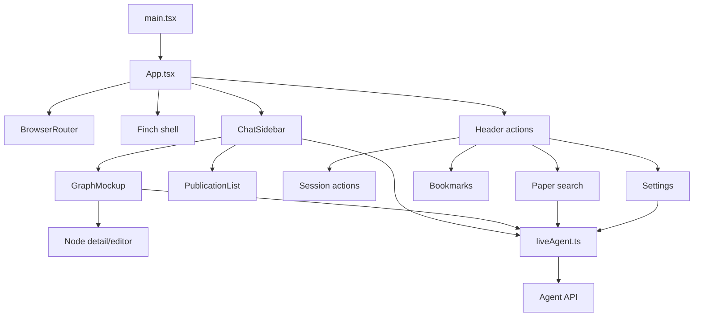
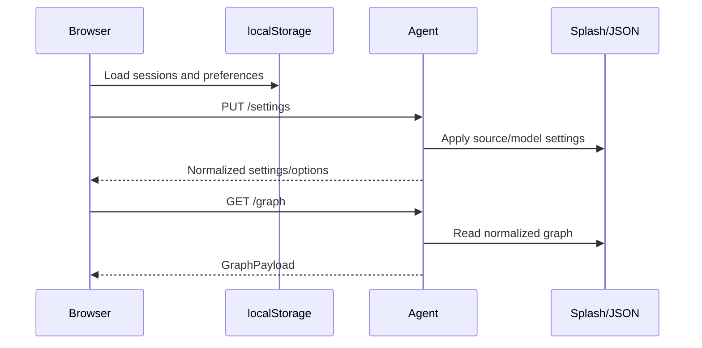

# UI architecture

## Technology stack

| Layer | Technology |
|---|---|
| Application | React 18, TypeScript, React Router 7 |
| Build/dev server | Vite 6 with the React plugin |
| Shell | `@blueskyproject/finch` |
| Styling | Tailwind CSS 4, CSS variables, Finch styles |
| UI primitives | Radix UI and shadcn-style local wrappers |
| Server state provider | TanStack Query provider |
| Graph rendering | Custom SVG renderer and deterministic layout |
| Icons/animation | Lucide React, Motion, and CSS animation |
| Tests | Vitest 3 with jsdom |
| Production serving | Nginx in the `frontend` container |

The current API client uses `fetch` directly; the application is wrapped in a
TanStack `QueryClientProvider` for Finch/application compatibility and future
query hooks.

## Application composition

`main.tsx` mounts `App` and imports the CSS entry point. `App.tsx` creates the
single FAIR2WISE `/` route, Finch navigation/header/content shell, top-level
graph state, and browser chat-session store.

## State ownership

| Owner | State |
|---|---|
| `App.tsx` | Active graph, selected answer/query, all browser sessions, active session |
| `ChatSidebar.tsx` | Input, active request, progress steps, elapsed time, streamed graph, answer animation, pinned answer, viewer mode |
| `GraphMockup.tsx` | Display subset, layout viewport, pan/zoom, hover/selection, node search, editor drafts |
| `AppSettingsButton.tsx` | Saved/draft settings, available server models/graphs, dialog state |
| `AppPaperSearchButton.tsx` | Search query, external-search toggle, results, copy state |
| `publicationFavorites.ts` | Bookmark storage and cross-tab synchronization |
| Agent backend | Workflow phase, pending approval, per-session memory, active runtime settings |
| Splash | Persistent editable graph |

Browser chat messages and backend session memory are intentionally separate.
The browser stores display history; the agent stores durable workflow context.
Both use the same session ID for each request.

## Boot sequence

The boot currently pushes saved browser preferences to the backend before
loading the graph. Failures are logged and leave the shell usable; API actions
surface user-facing errors later.

## Chat request lifecycle

1. `ChatSidebar` snapshots up to eight recent non-empty messages.
2. It appends the user message and creates an `AbortController` plus a request
   sequence number.
3. `queryLiveAgentStream()` posts to `/chat/stream`.
4. Progress events update the status line or merge live graph fragments.
5. A complete event becomes a persisted assistant message and updates the
   top-level graph/answer selection.
6. The answer text is revealed incrementally for display.
7. Errors become assistant error cards; aborts do not create an error card.

Sequence numbers prevent an obsolete or cancelled request from mutating a new
session. Selecting a different chat cancels the old request and restores the
new session's last graph selection.

## Source inventory

### Shell and header actions

| File | Responsibility |
|---|---|
| `App.tsx` | Shell, route, boot, sessions, graph state |
| `AppNewChatButton.tsx` | Create a new session |
| `AppSearchChatsButton.tsx` | Filter, select, and delete sessions |
| `AppPaperSearchButton.tsx` | KG/OpenAlex publication discovery and citation copying |
| `AppBookmarksButton.tsx` | Saved-publication sheet |
| `AppSettingsButton.tsx` | Runtime preference editor and server synchronization |

### Conversation and graph

| File | Responsibility |
|---|---|
| `ChatSidebar.tsx` | Streaming chat, progress, decisions, response rendering, graph split |
| `GraphMockup.tsx` | Live SVG graph, viewer, search, details, and edits |
| `KGInfoPanel.tsx` | Node/edge hover popup |
| `AsciiOrb.tsx` | Empty/loading indicator with reduced-motion handling |
| `CodeBlock.tsx` | Source display and clipboard action |
| `AppErrorMessage.tsx` | Shared failed-request alert |

### Publications and citations

| File | Responsibility |
|---|---|
| `PublicationList.tsx` | Publication metadata, links, collapsing, and actions |
| `PublicationFavoriteButton.tsx` | Bookmark toggle |
| `publicationFavorites.ts` | Stable bookmark keys and local persistence |
| `publicationLinks.ts` | DOI/arXiv parsing and Semantic Scholar fallback links |
| `kgCitations.ts` | Answer highlighting and evidence-to-node resolution |
| `kgNodeColors.ts` | Schema class normalization, filtering, and palette |

### Data and persistence

| File | Responsibility |
|---|---|
| `data/liveAgent.ts` | Wire types, HTTP requests, SSE parser, fallback logic |
| `agentSettings.ts` | Local settings model, defaults, aliases, API mapping |
| `chatSessions.ts` | Session creation, normalization, migration, search, storage cap |
| `agentApiErrors.ts` | Backend/network error parsing and actionable messages |

### Compatibility and prototype modules

| File | Status |
|---|---|
| `ChatPanel.tsx` | Prototype/mock chat surface; not mounted by `App.tsx` |
| `GraphCanvas.tsx` | Earlier graph renderer; not the live graph surface |
| `data/mockRag.ts` | Prototype keyword response generator |
| `data/mockupData.ts`, `data/materialsData.ts` | Prototype graph fixtures/types |
| `figma/ImageWithFallback.tsx` | Figma-generated image compatibility helper |
| `app/index.ts`, `components/index.ts` | Re-export surface for selected UI modules |

## UI primitive library

`components/ui/` contains local Radix/shadcn-style wrappers. The directory
includes accordion, alerts, dialogs, sheets/drawers, dropdown/context menus,
forms and inputs, buttons/toggles, tabs, tables, cards, tooltips/popovers,
navigation, resizable panels, scroll areas, calendars, carousels, charts,
sidebars, skeleton/progress displays, and utility hooks.

These are source-owned components rather than a generated runtime dependency.
Feature code should reuse them before adding another interaction library.

## Browser persistence model

`chatSessions.ts`, `agentSettings.ts`, and `publicationFavorites.ts` validate
stored values before using them. Invalid values fall back to defaults; storage
quota/privacy failures do not prevent application startup.

The legacy single-chat key is migrated into the current multi-session schema.
Chat messages are capped at 80 per session, while only eight recent messages
are sent with a request.

See [UI user guide](ui-user-guide.md#browser-persistence) for the storage-key
table.

## Styling architecture

`src/styles/index.css` imports fonts, Tailwind, and theme layers. `theme.css`
defines light/dark design tokens and maps them into Tailwind's theme. Much of
the active FAIR2WISE surface uses explicit light Slate/Sky utility classes; a
complete application-level dark-mode switch is not currently exposed.

Finch provides the hub shell stylesheet. `vite.config.ts` enables React,
Tailwind, the `@` alias to `src`, and a compatibility resolver for
`figma:asset/...` imports.

## Rendering and safety boundaries

- React escapes answer, metadata, and graph strings; the UI does not inject
  raw answer HTML.
- Message rendering recognizes paragraphs and fenced code without executing
  code.
- Service credentials remain in the backend environment and are never placed
  in Vite variables.
- External publication links open with `noopener noreferrer`.
- Compose exposes only Nginx; private backend/Splash ports are not browser
  entry points.
- JSON graph paths and graph mutations receive final validation in the agent
  API rather than trusting browser controls.

## Accessibility behavior

Interactive icon controls carry labels/titles, dialogs and sheets use Radix
focus management, graph panning uses pointer capture, and the loading orb
honors `prefers-reduced-motion`. The custom SVG graph is primarily visual; node
search and the detail panel provide the keyboard-oriented route to graph data.
